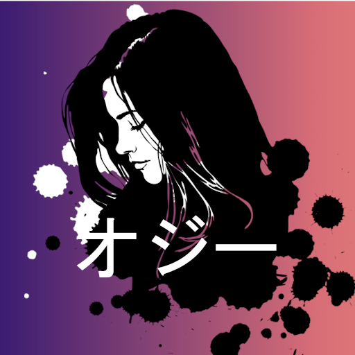

# Ozzie
A modular Discord bot made in Java with JDA.
 
## Getting Started

If you're comfortable getting up and running from a `git clone`, this method is for you.

The [master](https://github.com/FlashyReese/Ozzie/) branch which contains the the most stable releases.

#### Prerequisites:
Java `8` or above

Gradle `6` or above

Discord bot token with all gateway intents

#### Quickstart:
1. Clone this project
2. Run > `gradle shadowJar`
4. Run > `java -jar .build/libs/Ozzie-{version}-all.jar --discordapi (Discord Token)`

# License

Copyright (C) 2019-2020 **Yao Chung Hu** / **FlashyReese**

>This program is free software: you can redistribute it and/or modify it under the terms of the GNU General Public License
>as published by the Free Software Foundation, either version 3 of the License, or (at your option) any later version. 
>                                                   
>This program is distributed in the hope that it will be useful, but WITHOUT ANY WARRANTY; 
>without even the implied warranty of MERCHANTABILITY or FITNESS FOR A PARTICULAR PURPOSE. 
>                                                   
>See the GNU General Public License for more details. 
>You should have received a copy of the GNU General Public License along with this program. If not, see http://www.gnu.org/licenses/

[The full license can be found here.](https://github.com/FlashyReese/Ozzie/blob/master/LICENSE)
